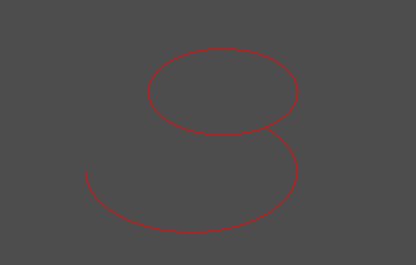
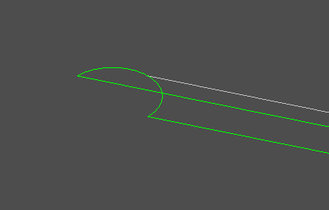
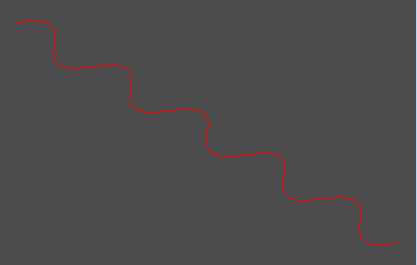
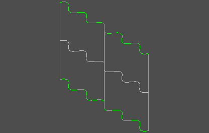
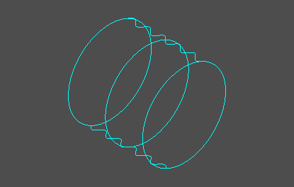
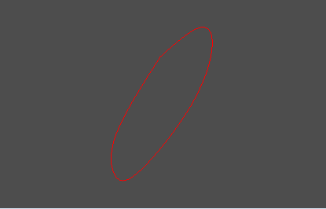

Demos
=======

These demos should illustrate how to combine the IGES entities to build more complex drawings and objects.

Arc and circle
----------------
.. literalinclude:: IGESTest.py
   :language: python
   :lines: 98, 101

.. literalinclude:: IGESTest.py
  :language: python
  :lines: 76, 79

Polyline
----------
.. literalinclude:: IGESTest.py
  :language: python
  :lines: 120-143

.. literalinclude:: IGESTest.py
  :language: python
  :lines: 235

.. literalinclude:: IGESTest.py
  :language: python
  :lines: 186-191

Spline Curve
--------------

.. literalinclude:: IGESTest.py
  :language: python
  :lines: 289-315

